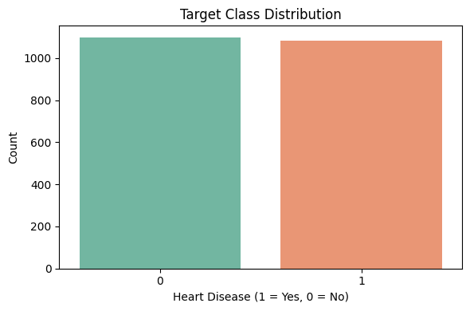
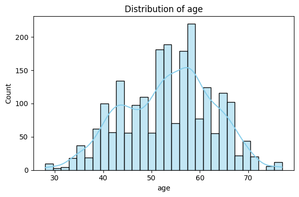
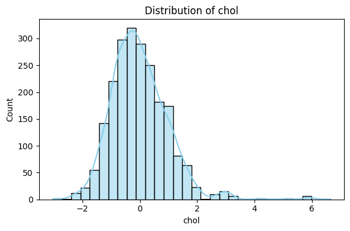
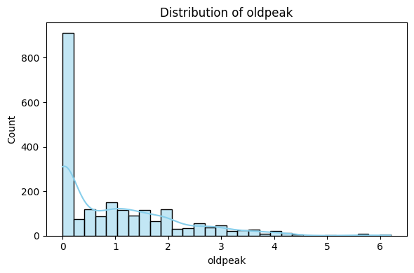
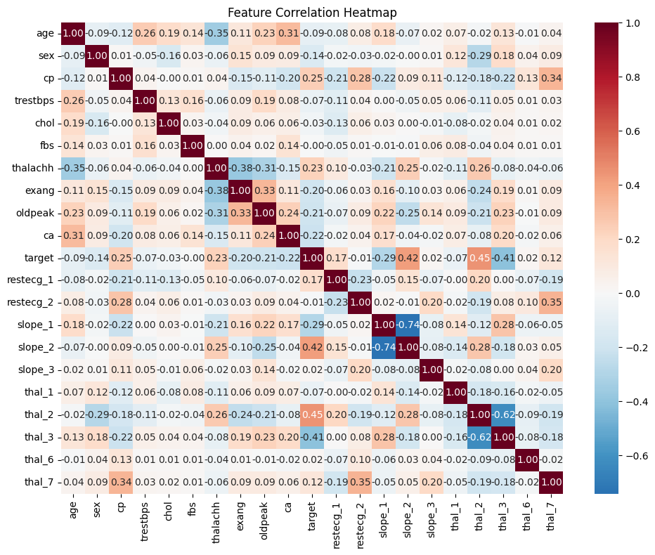
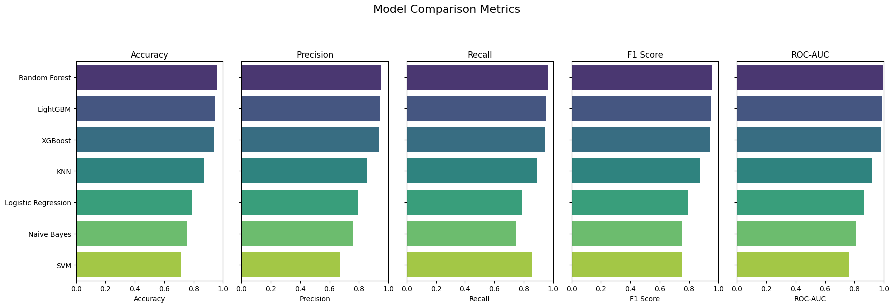
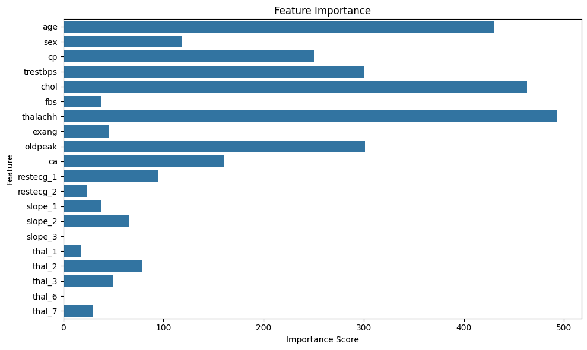
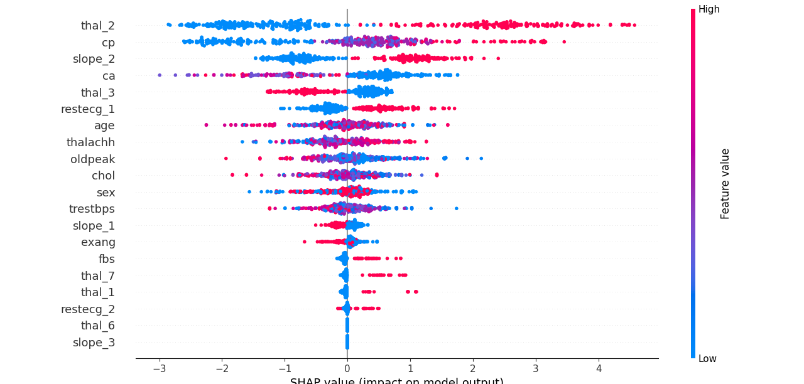

# Heart Disease Risk Prediction

## Project Title
Heart Disease Risk Prediction Using Machine Learning

[]()
-orange)


[]()

## 🚀 Live Demo
Try the interactive Streamlit app:  
🔗 https://heart-disease-risk-analysis-fp3kwoltyssc86y3pldvuz.streamlit.app/

[](https://heart-disease-risk-analysis-fp3kwoltyssc86y3pldvuz.streamlit.app/)

## Overview
Cardiovascular disease is a leading global cause of morbidity and mortality. Early identification of individuals at high risk enables timely intervention and improved clinical outcomes.
This project develops and evaluates multiple machine learning models to predict the presence of heart disease using structured patient health data.
The project emphasizes model performance comparison, clinical interpretability, and responsible AI use for decision-support prototyping.

## Client Value Framing
The primary value of this project lies in demonstrating how machine learning–based risk scores and explainability techniques can support population-level cardiovascular risk assessment, clinical analytics, and early-stage product prototyping, rather than delivering individual-level diagnostic decisions.

## Objectives
- Predict the presence of heart disease using patient clinical features
- Compare classical and advanced machine learning classifiers
- Identify clinically meaningful risk factors using model interpretability tools
- Provide a transparent, research-oriented decision-support prototype

---
## Intended Use
This project is intended as a **research and decision-support prototype** demonstrating machine learning–based risk prediction and model interpretability for heart disease using structured clinical features.
The analysis is designed for **educational purposes, technical evaluation, and exploratory risk stratification** only. It is not intended to guide individual patient diagnosis, treatment decisions, or clinical care pathways.
Any real-world deployment would require **external validation, institutional review, and appropriate regulatory and clinical governance approval**.

---
## Potential Clinical & Operational Applications

This model is designed as a **population-level risk stratification and decision-support prototype**, rather than an individual diagnostic tool.

Potential applications include:

- **Preventive cardiology screening:**
Identifying individuals at elevated cardiovascular risk to prioritize lifestyle interventions, further diagnostic testing, or specialist referral.

- **Risk-based patient stratification:**
Supporting clinicians and care managers in categorizing patients into low- and high-risk groups for targeted follow-up programs.

- **Clinical decision-support prototyping:**
Demonstrating how machine learning–based risk scores and explainability tools (SHAP) can augment clinician understanding of key risk drivers.

- **Healthcare analytics and education:**
Serving as a teaching and demonstration tool for medical trainees, data scientists, and healthcare stakeholders exploring interpretable ML in clinical contexts.

- **Health-tech product development:**
Acting as a proof-of-concept model for startups or research teams developing early-stage cardiovascular risk assessment tools.

These applications assume population-level analysis and retrospective data exploration and are not intended for real-time clinical decision-making without prospective validation and regulatory approval.

---
## Dataset
- Source: raw_merged_heart_dataset.csv (Kaggle Heart Disease Prediction) The dataset represents a merged retrospective cohort compiled from multiple public heart disease studies.
- Sample Size: 1,744 patients (after data cleaning)
- Target Variable:
  - **1** = Heart disease present
  - **0** = No heart disease
- Class Distribution:
  - **862** positive cases
  - **882** negative cases (balanced dataset)

## Key Features
- Age
- Resting blood pressure (trestbps)
- Cholesterol (chol)
- Maximum heart rate (thalachh)
- ST depression (oldpeak)
- Chest pain type (cp)
- Resting ECG (restecg)
- Slope, thal

## Data Preprocessing
- Replaced ambiguous values (?, unknown, 999, -1) with NaN
- Median imputation for missing numerical values
- Feature scaling using StandardScaler
- One-hot encoding for categorical variables
- Stratified train–test split (80/20, random_state = 42)

## Models Compared
- Logistic Regression
- K-Nearest Neighbors (KNN)
- Support Vector Machine (SVM)
- Naive Bayes
- Random Forest
- XGBoost
- LightGBM

## Evaluation Metrics
- Accuracy
- Precision
- Recall
- F1 Score
- ROC–AUC

Evaluation was performed on a held-out test set.

---
## Best Model

- **Random Forest** achieved the strongest overall performance  
  - Highest **F1 Score (0.959)** and **ROC–AUC (0.995)**
  - Excellent balance of precision and recall, making it suitable for experimental risk stratification in retrospective datasets.
- **LightGBM** is used as a complementary model  
  - Slightly lower predictive performance
  - Faster inference and strong compatibility with SHAP explanations

## Model Summary

| Model                | Accuracy | Precision | Recall | F1 Score | ROC–AUC |
|----------------------|----------|-----------|--------|----------|---------|
| Random Forest        | 0.959    | 0.951     | 0.968  | 0.959    | 0.995   |
| LightGBM             | 0.947    | 0.942     | 0.955  | 0.948    | 0.991   |
| XGBoost              | 0.941    | 0.937     | 0.945  | 0.941    | 0.983   |
| KNN                  | 0.870    | 0.856     | 0.891  | 0.873    | 0.920   |
| Logistic Regression  | 0.792    | 0.795     | 0.791  | 0.793    | 0.868   |
| Naive Bayes          | 0.753    | 0.757     | 0.750  | 0.753    | 0.808   |
| SVM                  | 0.714    | 0.669     | 0.855  | 0.750    | 0.763   |

> All metrics were computed on a held-out test set using internal validation only.

> **Recommendations**: Random Forest is the strongest candidate for experimental risk stratification and benchmarking, based on F1 score and ROC–AUC performance.

> **Model Selection Rationale**:  
> Random Forest was selected as the best-performing model based on F1 score and ROC–AUC.  
> LightGBM is included as an alternative for interpretability and deployment efficiency, particularly in the Streamlit demo.

## Model Interpretability

- SHAP summary plots are generated using the **LightGBM model**
- Provides global feature importance and direction of impact
- Top predictors include:
  - `thalachh` (maximum heart rate)
  - `cp` (chest pain type)
  - `oldpeak` (ST depression)
  - `age`

Using LightGBM for SHAP ensures stable and computationally efficient explanations while maintaining strong predictive performance.

## Limitations
- Results are based on a retrospective, merged Kaggle dataset.
- No external or prospective validation was performed.
- Performance may not generalize to other populations or clinical settings.

## Visuals








Additional visuals, including confusion matrices for each model, are available in the Technical Appendix (see `report/Heart_Disease_Risk_Analysis_Report.pdf`).

## Folder Structure
```
heart-disease-risk-analysis/
├── data/
│   └── raw_merged_heart_dataset.csv
├── src/
│   ├── heart_disease_pipeline.py
│   ├── eda_model_comparison.ipynb
│   └── app.py   
├── visuals/
│   └── [All plots: SHAP, feature importance, etc.]
├── report/
│   └── Heart_Disease_Risk_Analysis_Report.pdf
├── requirements.txt
├── MODEL_CARD.md
├── README.md
```

---
## Installation

1. Clone the repository:
   ```bash
   git clone https://github.com/global-ad-snap/heart-disease-risk-analysis.git
   cd heart-disease-risk-analysis
   ```
2. Create a virtual environment:
   ```bash
   python -m venv venv
   ```
3. Activate the virtual environment:
   ```bash
   source venv/bin/activate   # macOS/Linux
   venv\Scripts\activate      # Windows
   ```
4. Install dependencies:
   ```bash
   pip install -r requirements.txt
   ```

## How to Run

1. Open the terminal in the project directory.
2. Run the pipeline:
   ```bash
   python src/heart_disease_pipeline.py
   ``` 
> The script will generate evaluation metrics and save visualizations in the visuals/ folder.


## Streamlit Demo

An interactive Streamlit web application allows users to:

- Adjust patient clinical features
- Receive real-time heart disease risk predictions
- View SHAP-based global explanations (LightGBM)

> **Note**:  
> While Random Forest achieves the highest predictive performance,  
> LightGBM is used in the Streamlit demo for faster inference and robust SHAP compatibility.

---
## Deployment Considerations

### Operational Integration

Potential deployment environments include clinical decision support systems, business analytics platforms, or API-based inference pipelines. Integration considerations include data availability, workflow compatibility, and stakeholder usability.

### Model Monitoring

Recommended post-deployment monitoring:

- Model performance drift detection
- Data distribution monitoring
- KPI tracking aligned with business or clinical outcomes
- Periodic model recalibration

Continuous monitoring is essential to maintain reliability.

### Human Oversight

For high-impact decisions:

- Human-in-the-loop review recommended
- AI outputs positioned as decision support rather than autonomous decision-making
- Clear escalation pathways for uncertain predictions

This is particularly critical in healthcare and financial risk contexts.

### Governance & Compliance Awareness

Deployment should consider:

- Data privacy requirements
- Auditability and reproducibility
- Documentation of validation evidence
- Regulatory context where applicable (e.g., healthcare AI)

Formal validation would be required before operational use.

### Environment
- Python **3.9 or 3.10** recommended  
- Tested on Windows and Linux

## Consulting Use Case

This project demonstrates applied capabilities relevant to:

- Clinical risk prediction using structured healthcare data
- Machine learning model benchmarking and selection
- Feature importance and explainability using SHAP
- Translating predictive outputs into decision-support insights
- Responsible AI documentation for healthcare applications

In a consulting engagement, this work would be delivered as a **risk prediction prototype**, accompanied by documentation outlining model performance, limitations, and ethical considerations.

---
## Clinical Impact

### Potential Value Drivers

This project is designed to support measurable operational or financial impact, including:

- Improved decision accuracy
- Operational efficiency gains
- Risk reduction
- Resource optimization
- Revenue protection or growth

### Example Deployment Benefits

Actual impact depends on deployment context, data quality, and operational integration. Potential benefits may include:

- Reduced operational costs through earlier risk identification
- Improved allocation of staff, inventory, or marketing resources
- Enhanced decision support for clinical or business stakeholders
- Increased transparency and confidence in analytics-driven decisions

### Measurement Considerations

Typical ROI evaluation would include:

- Baseline vs post-deployment performance comparison
- Cost savings analysis
- Revenue uplift measurement
- Error reduction metrics
- Operational efficiency indicators

Formal ROI validation requires real-world deployment data.

---
## Validation & Reliability Considerations

### Dataset Limitations

Results are dependent on dataset scope, quality, and representativeness. Potential limitations include sample bias, missing data, and historical data constraints. External validation on independent datasets would be required before operational deployment.

### Model Validation Approach

Validation methods may include:

- Train/test separation or cross-validation
- Performance metrics relevant to the use case
- Sensitivity to class imbalance where applicable
- Error pattern analysis

These steps help estimate generalization performance but do not replace real-world validation.

### Clinical / Operational Validation Requirements

For healthcare or high-stakes applications, additional validation typically includes:

- Prospective evaluation in operational settings
- Clinical or domain expert review
- Workflow compatibility testing
- Safety and performance monitoring after deployment

Formal regulatory approval may be required depending on jurisdiction and intended use.

### Performance Interpretation

Model outputs should be interpreted cautiously:

- Predictions support, not replace, expert decision-making
- Performance metrics reflect dataset conditions
- Continuous monitoring is recommended post-deployment

---

## Client-Ready Deliverables
In a real-world consulting engagement, this project would be delivered as:
- Cleaned and documented dataset
- Trained and validated ML model
- Model performance report with clinical interpretation
- Explainability artifacts (SHAP / Grad-CAM where applicable)
- Interactive demo or dashboard (Streamlit)
- Model card and risk & limitation documentation

---
## License

This project is licensed under the **MIT License**.  
See the [LICENSE](LICENSE) file for details.

## Disclaimer
This project does **not constitute medical advice, diagnosis, or treatment recommendations**. The models were developed using retrospective, publicly available datasets and may not generalize to other populations, healthcare systems, or clinical settings.
Model outputs represent probabilistic risk estimates rather than deterministic predictions. Performance metrics are limited to internal validation and do not reflect prospective clinical performance.
This project is **not a certified medical device** and must not be used for clinical decision-making.

## Author

**Medical AI & Healthcare Data Science Consultant**

Physician (MBBS) with a Master’s (Global Communication) and professional training in Machine Learning, Deep Learning, Natural Language Processing, and AI for Medicine. I help healthcare startups, researchers, and digital health teams apply machine learning to build clinical risk models, analyze medical data, and prototype AI-driven decision-support systems, translating real-world healthcare data into actionable insights.
